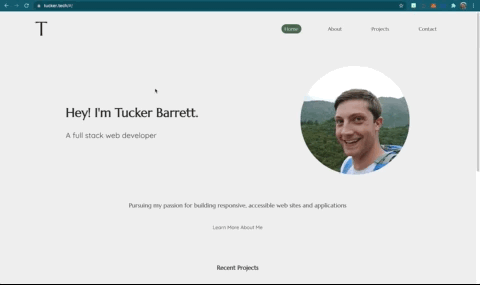

# Tucker Barrett's Portfolio

This is my portfolio website, created using React.

## Link to Deployed Site

[Tucker's Portfolio](https://tucker.tech)

## Table of Contents
  * [Technologies](#technologies)
  * [Functionality](#functionality)
  * [Future Development](#future-development)
  * [Contact](#contact)
  * [License](#license)

## Technologies

&nbsp;
&nbsp;
&nbsp;
&nbsp;
&nbsp;

## Functionality

#### Application Demo

## Future Development

* I would like to turn this into a full stack application, using MongoDB and GraphQL for the backend. The purpose of this would be to have all of my projects in a database, allowing for more streamlined updating of portfolio projects through a CMS.
* I need to either make the email form actually email me, or remove it altogether in favor of something else.

## Contact
Email me any time with questions, comments, or cat/dog photos! - ctbarrett.tech@gmail.com

## License
&copy; 2021 Charles Tucker Barrett

[MIT License](https://opensource.org/licenses/MIT)